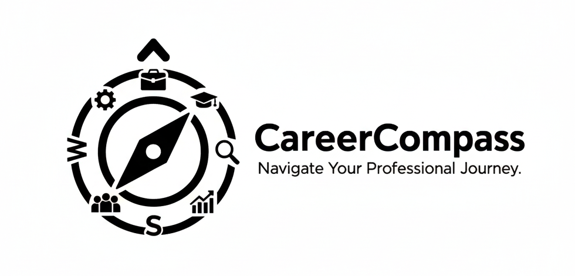

# CareerCompass 🧭

<div align="center">
  
  
  ### Navigate Your Professional Journey
  
  *[English](#english) | [Türkçe](./README_TR.md)*
</div>

---

<a name="english"></a>

### About CareerCompass

CareerCompass is an AI-powered career guidance platform that helps job seekers navigate their professional journey with confidence. By leveraging advanced AI technologies and vector search capabilities, we provide personalized job matching, CV analysis, and intelligent career recommendations.

**Our Mission:** To empower professionals with data-driven insights and AI-assisted guidance, making career transitions smoother and job searches more effective.

### Key Features

🎯 **AI-Powered Job Search** - Natural language job search using semantic understanding  
📄 **Smart CV Analysis** - Compare your CV against job postings with AI-driven insights  
🔍 **Intelligent Job Matching** - Find jobs that match your skills and experience  
📚 **Learning Recommendations** - Get personalized course and resource suggestions  
🌐 **Multi-Source Integration** - Scrape and analyze jobs from LinkedIn and other platforms  

---

### 🏗️ Technical Architecture

CareerCompass is built with a modern, scalable architecture:

#### Backend Stack
- **FastAPI** - High-performance Python web framework
- **Superlinked** - Advanced multi-modal vector framework with unified embeddings for complex data relationships
- **Qdrant** - High-performance vector database optimized for similarity search and semantic retrieval at scale
- **Groq/OpenAI** - LLM integration for intelligent analysis
- **Docker** - Containerized deployment

#### Frontend Stack
- **Next.js 16** - React framework with server-side rendering
- **React 19** - Latest React with concurrent features
- **Tailwind CSS 4** - Modern utility-first CSS framework
- **Radix UI** - Accessible component primitives
- **Framer Motion** - Smooth animations
- **Axios** - HTTP client for API communication

#### AI & Data Processing
- **Superlinked Vector Search** - Semantic job matching in natural language
- **LLM Integration** - CV analysis and recommendations
- **Web Scraping** - LinkedIn and GitHub data extraction
- **Kaggle Datasets** - Job posting data aggregation

**AI Models Used:**
- **Llama 3.3 70B Versatile** - Primary LLM for CV analysis and recommendations (via Groq)
- **Llama 4 Maverick 17B 128e Instruct** - Natural language query processing for semantic search
- **IBM Granite Embedding Small English R2** - Text embedding for vector search

---

### 🚀 Installation Guide

Follow these steps to set up CareerCompass on your local machine:

#### Prerequisites
- Python 3.12+
- Node.js 18+
- Docker & Docker Compose
- (Optional) NVIDIA GPU with CUDA support

#### Step 1: Clone the Repository
```bash
git clone https://github.com/Llamallience/hackathon-final.git
cd hackathon-final
```

#### Step 2: Create Python Environment
```bash
# Create a Python 3.12 virtual environment
python -m venv venv

# Activate the environment
# On Windows (PowerShell):
.\venv\Scripts\Activate.ps1

# On Windows (Command Prompt):
.\venv\Scripts\activate.bat

# On Linux/Mac:
source venv/bin/activate

# Install backend dependencies
cd backend
pip install -r requirements.txt
```

#### Step 3: Download Job Data
```bash
# Run the downloader script to fetch job datasets from Kaggle
python scripts/downloader.py
```

**⚠️ Verification:** Check that `backend/data/jobs.csv` has been created successfully. This file should contain the merged job postings from multiple Kaggle datasets.

#### Step 4: Normalize Job Data
```bash
# Process and normalize the job data
python scripts/normalize_jobs.py
```

**⚠️ Verification:** Check that `backend/data/schema.json` has been created successfully. This file contains the categorized job metadata.

#### Step 5: Start Docker Services

**Option A - For NVIDIA GPU Users:**
```bash
# Use GPU-optimized docker-compose
docker-compose -f docker-compose.gpu.yml up -d
```

**Option B - For CPU Users:**
```bash
# Use standard docker-compose
docker-compose up -d
```

This will start three services:
- **Qdrant** (Vector Database) - http://localhost:6333
- **Superlinked** (Vector Search API) - http://localhost:8080
- **Backend** (FastAPI) - http://localhost:8000

#### Step 6: Load Data into Qdrant

You have two options for loading the job data into Qdrant:

##### Option 6.1: Load from Snapshot (Recommended - Faster)

1. Download the pre-processed snapshot from: `<snapshot_link>` (to be provided)
2. Navigate to Qdrant Dashboard: http://localhost:6333/dashboard#/collections
3. Click the **"Upload Snapshot"** button in the top-right corner
4. Set collection name to: **"default"**
5. Select and upload the downloaded snapshot file
6. Wait until the collection status turns **green** ✅

##### Option 6.2: Process Data Manually (Advanced)

1. Get the data loader configuration:
```bash
# Send GET request
curl http://localhost:8080/data-loader/
```

Example response:
```json
{
  "result": {
    "job_postings": "DataLoaderConfig(path='data/jobs.csv', format=<DataFormat.CSV: 1>, name='job_postings', pandas_read_kwargs={'chunksize': 1000, 'converters': {'job_skills': <function <lambda> at 0x7faf18023b50>}})"
  }
}
```

2. Use the `name` value from the response to trigger data processing:
```bash
# Send POST request with the data loader name
curl -X POST http://localhost:8080/data-loader/job_postings/run
```

3. Monitor the progress in Docker logs:
```bash
docker logs -f <superlinked_container_name>
```

The data loading process may take several minutes depending on the dataset size.

#### Step 7: Setup Frontend

```bash
# Navigate to frontend directory
cd ../frontend

# Install dependencies
npm install

# Start development server
npm run dev
```

The application will be available at: http://localhost:3000

---

### 🎮 Usage

1. **Welcome Page** - Get an overview of CareerCompass features
2. **AI Job Search** - Use natural language to search for jobs
3. **CV vs Job Analysis** - Upload your CV and compare it with job postings
4. **Job Match** - Upload your CV to find the best matching jobs

---

### 🔧 Environment Variables

Create `.env` files in the appropriate directories:

**backend/.env:**
```env
GROQ_API_KEY=your_groq_api_key_here
SUPERLINKED_URL=http://localhost:8080
```

**backend/superlinked_app/.env:**
```env
# Ollama API settings for natural language query processing
OPENAI_API_KEY=your_groq_api_key_here
OPENAI_BASE_URL=https://api.groq.com/openai/v1
OPENAI_MODEL=meta-llama/llama-4-maverick-17b-128e-instruct

# Qdrant Vector Database (default localhost)
QDRANT_URL=http://qdrant:6333
QDRANT_API_KEY=

# Embedding model settings
TEXT_EMBEDDER_NAME=ibm-granite/granite-embedding-small-english-r2

# Data processing
CHUNK_SIZE=1000
```

> **Note:** You can use the same `GROQ_API_KEY` for both `backend/.env` and `backend/superlinked_app/.env` files.

---

### 📊 Data Sources

This project uses the following Kaggle datasets for demonstration purposes:

- **Data Analyst Jobs** - [asaniczka/data-analyst-job-postings](https://www.kaggle.com/datasets/asaniczka/data-analyst-job-postings)
- **Data Engineer Jobs** - [asaniczka/linkedin-data-engineer-job-postings](https://www.kaggle.com/datasets/asaniczka/linkedin-data-engineer-job-postings)
- **Data Scientist Jobs** - [asaniczka/data-scientist-linkedin-job-postings](https://www.kaggle.com/datasets/asaniczka/data-scientist-linkedin-job-postings)
- **Software Engineer Jobs** - [asaniczka/software-engineer-job-postings-linkedin](https://www.kaggle.com/datasets/asaniczka/software-engineer-job-postings-linkedin)

These datasets are automatically downloaded and merged by the `downloader.py` script during the setup process.

---

### 📚 API Documentation

Once the backend is running, access the interactive API documentation:
- **Swagger UI:** http://localhost:8000/docs
- **ReDoc:** http://localhost:8000/redoc

---

### 🤝 Contributing

We welcome contributions! Please follow these steps:

1. Fork the repository
2. Create a feature branch
3. Commit your changes
4. Push to your fork
5. Open a Pull Request

---

### 📄 License

This project is licensed under the MIT License.

---

### 👥 Team

Built with ❤️ by the Llamallience team during the hackathon.

---

<div align="center">
  
### 🌟 CareerCompass - Navigate Your Professional Journey 🧭

Made with 💙 by Llamallience

</div>
